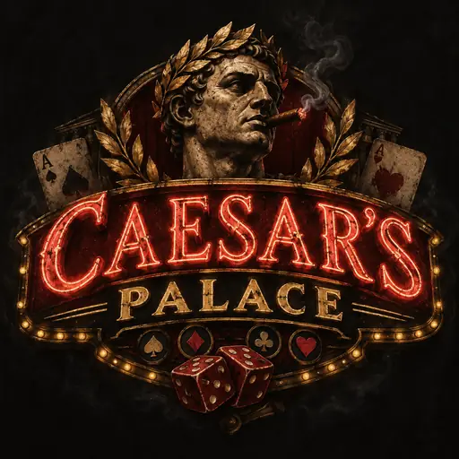

# Caesar’s Palace — approved icon design

Related implementation issue: [#369](https://github.com/flabber1835/stocker/issues/369).

## Approved selection

The operator selected **option 1: the red-neon casino emblem** on 2026-09-12 and approved its subsequent Home Screen presentation.

The user-facing system name is **Caesar’s Palace**. Preserve the apostrophe and spelling. Use `caesars-palace` for asset filenames.

## Visual identity

The requested character is a sketchy, worn gambling hall: dark charcoal background, smoky atmosphere, distressed red-neon CAESAR’S lettering, aged-gold PALACE lettering, a Roman bust wearing gold laurels and smoking a cigar, playing cards, red dice, and warm marquee bulbs.

This file carries the selected artwork. Preserve its composition, wording, and visual identity when producing the final app-icon assets. Any substantive redesign requires operator review.

## Asset provenance

- File: `icon-design.webp`
- Dimensions: **512 × 512 pixels**
- Format: opaque RGB WebP
- Source: the selected 1254 × 1254 generated PNG, `caesar_s_palace_neon_casino_emblem.png`
- Preparation: Lanczos resize and WebP encoding at quality 70; artwork composition retained
- File size: 32,258 bytes
- SHA-256: `1c5b0b3eae4498007a7d4ae7f23787adb3d23ff0001b692395d024febd0096f4`
- Git blob SHA: `0d91620733acdd3cbd29b56a820c51ce80773cee`

This is the committed design-reference asset. Runtime integration and browser/device acceptance belong to issue #369.

## Codex implementation brief for #369

1. Use **Caesar’s Palace** for the dashboard’s visible product name, document title, Home Screen metadata, manifest name, and notification identity wherever the platform exposes it.
2. Produce PNG exports from the selected design for the Apple touch icon and web-app manifest. Include 180 × 180, 192 × 192, and 512 × 512 variants as appropriate to the implemented declarations. Keep generation reproducible.
3. Supply opaque square source artwork. Let the platform apply its Home Screen mask. Check that the face, title, and marquee remain visible through the platform mask.
4. Inspect the small Home Screen rendering on iPhone 16, plus light/dark presentation and portrait/landscape dashboard layouts. The earlier Home Screen presentation was a visual mockup; device acceptance remains required.
5. Connect the assets to the HTML and manifest, including `apple-touch-icon`, app-name metadata, and manifest icon declarations. Add route, packaging, MIME-type, and asset-presence tests.
6. Keep the manifest identity and Tailscale HTTPS origin stable. Document the installation/update behavior for existing Home Screen shortcuts.
7. Keep the decorative red-neon branding visually separate from the operational health indicators. Preserve the agreed semantics: green = healthy/current; amber = reviewed automatic recovery active; red = operator intervention required.
8. Limit branding changes to presentation and icon metadata. Preserve internal Sentinel/Wealth Core identifiers, database schemas, certificates, strategy fingerprints, and execution authority.

The existing #369 requirements remain: Tailscale is the access-control boundary, application login is unnecessary, direct Web Push replaces the required ntfy dependency, and complete NAS outage monitoring is handled separately by Synology tooling.

## Acceptance checklist

- [ ] Approved option-1 artwork supplies the icon exports.
- [ ] Home Screen identity reads Caesar’s Palace.
- [ ] Dashboard, manifest, touch-icon metadata, and notification presentation use consistent branding.
- [ ] Icon remains recognizable at actual Home Screen size and under the iOS mask.
- [ ] Exported files are packaged and served correctly through the existing Tailscale HTTPS origin.
- [ ] Branding stays independent of runtime health colors and financial authority.
- [ ] Existing operational and notification requirements in #369 remain satisfied.
